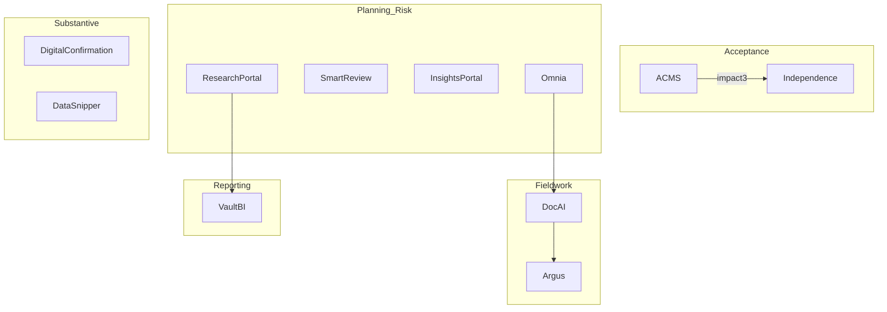

# Audit-Tech – Phase, Impact/Effort & Audit‑Context Use

Each table now includes a new **“Audit Use / Outcome”** column that boils down *what the system actually does for the engagement team*.

---

## 1. Core Systems 🗄️

| Technology                     | Audit Phase        | Audit Use / Outcome                                                                                  | Deployed? | Impact | Effort | AI / Value Opportunity                    | Notes                          |
| ------------------------------ | ------------------ | ---------------------------------------------------------------------------------------------------- | --------- | ------ | ------ | ----------------------------------------- | ------------------------------ |
| **Omnia**                      | Fieldwork          | Primary working‑paper repository for large, complex audits; drives engagement workflow & assertions. | **Yes**   | **3**  | 2      | GenAI pre‑populates docs; anomaly alerts. | Gap vs EMS; MAT globalisation. |
| **Levvia**                     | Fieldwork          | Cloud audit file for very small audits (VSA); lighter UI, faster setup.                              | **Yes**   | 2      | 2      | Predictive planning assistant.            | v3 live Oct 2024.              |
| **EMS Client**                 | Fieldwork          | Legacy on‑prem engagement file; structured/unstructured docs.                                        | **Yes**   | 2      | 3      | AI comment summariser.                    | EOL May 2027.                  |
| **Audit Online / Diagnostics** | Field‑Review       | Dashboards over EMS KPIs; milestone compliance.                                                      | **Yes**   | 2      | 1      | Real‑time risk flags.                     | Web layer on EMS.              |
| **QAP (Quality Assessment)**   | Quality Mgmt       | ISQM‑1 control monitoring & evidence store.                                                          | **Yes**   | 2      | 2      | AI control gap analysis.                  | ServiceNow.                    |
| **InsightBox**                 | Substantive Assist | Packaged analytics (JEs, risk assessments) with no data scientist needed.                            | **Yes**   | 2      | 2      | GenAI recommends analytic packs.          | AU‑only.                       |
| **Digital Confirmation**       | Substantive        | Handles bank confirms incl. RADC API link.                                                           | No        | 2      | 1      | Fully API‑driven confirmations.           | Decommissioned in AU.          |
| **DocAI (Document AI)**        | Fieldwork          | ML/NLP doc interrogation; extracts key clauses.                                                      | Pilot     | **3**  | 2      | GenAI clause extraction.                  | Replaces Kira.                 |
| **Asset Count**                | Substantive        | Mobile photo app to capture inventory count evidence.                                                | No        | 1      | 1      | Vision auto‑classification.               | BYOD hurdle.                   |
| **Checklist**                  | All                | Digital sign‑off checklists per phase/standard.                                                      | **Yes**   | 1      | 1      | GenAI auto‑flag issues.                   | –                              |
| **Scribe**                     | Reporting          | Drafts memos / standard docs from templates.                                                         | No        | 2      | 2      | GenAI memo drafting.                      | US memo live.                  |
| **ACTT**                       | Controls           | Automates ERP SOD, GITC, FAC testing.                                                                | **Yes**   | 2      | 3      | AI remediation suggestions.               | Global.                        |

---

## 2. Analytics & AI 📊

| Technology                | Audit Phase | Audit Use / Outcome                                    | Deployed? | Impact | Effort | AI Opportunity                 |
| ------------------------- | ----------- | ------------------------------------------------------ | --------- | ------ | ------ | ------------------------------ |
| **Argus / DocAI**         | Fieldwork   | NLP engine to extract, tag & risk‑score docs.          | Pilot     | **3**  | 2      | Auto‑risk memos.               |
| **DataSnipper**           | Fieldwork   | Excel add‑in to match source docs to data & tick‑mark. | **Yes**   | 2      | 1      | GenAI explanations.            |
| **Process X‑ray**         | Planning    | Process‑mining visual + control deviation IDs.         | No        | 2      | 3      | AI test suggestions.           |
| **Omnia DNAV**            | Substantive | Automated valuation for securities / funds.            | No        | 2      | 3      | LLM commentary.                |
| **Reveal Analytics**      | Substantive | Regression/predictive analytics for SAPs.              | **Yes**   | 2      | 2      | LLM plain‑English outputs.     |
| **Audit Insights Portal** | Planning    | Combines multi‑source data for risk heat‑map.          | **Yes**   | 2      | 2      | Forecast emerging risk trends. |
| **Data Science Platform** | Cross       | Azure Databricks et al. for custom models.             | **Yes**   | 2      | 2      | Secure GenAI sandbox.          |
| **Omnia Data**            | Reporting   | Tableau/Power BI data mart of Omnia evidence.          | Pilot     | 2      | 2      | GenAI narrative dashboards.    |

---

## 3. GenAI Roadmap 🤖

| Technology             | Phase    | Audit Use / Outcome                        | Status           | Impact | Effort | Value                      |
| ---------------------- | -------- | ------------------------------------------ | ---------------- | ------ | ------ | -------------------------- |
| **Smart Review**       | Controls | LLM auto‑reviews control docs vs criteria. | Planned May 2025 | **3**  | 1      | Suggests fixes instantly.  |
| **Research Assistant** | Planning | Chatbot over standards & guidance.         | Pilot            | 2      | 2      | Faster technical research. |

---

## 4. Learning & Knowledge 📚

| Tech            | Phase       | Audit Use / Outcome                  | Deployed? | Impact | Effort | AI Boost              |
| --------------- | ----------- | ------------------------------------ | --------- | ------ | ------ | --------------------- |
| Research Portal | Planning    | Search Deloitte manuals & standards. | **Yes**   | **3**  | 2      | LLM Q\&A.             |
| Clever Nelly    | Continuous  | Spaced micro‑learning quizzes.       | **Yes**   | 2      | 2      | Personalised paths.   |
| Auditorium      | Methodology | Repository of templates/forms.       | **Yes**   | 1      | 1      | Template recommender. |
| GAATE           | Talent      | Self‑assessment vs global standards. | **Yes**   | 1      | 2      | Career coach.         |
| DART            | Planning    | Legacy accounting library.           | Sunset    | 1      | 1      | –                     |

---

## 5. Support & Collaboration 🤝

| Technology                      | Phase               | Audit Use / Outcome                         | Deployed? | Impact | Effort | AI Opportunity                    |
| ------------------------------- | ------------------- | ------------------------------------------- | --------- | ------ | ------ | --------------------------------- |
| Deloitte Connect                | Onboard‑Substantive | Secure PBC, file exchange, status.          | **Yes**   | **3**  | 2      | Smart PBC bot; event sync.        |
| ACMS                            | Acceptance          | PIE & rotation register (ServiceNow).       | **Yes**   | 2      | 2      | Partner‑rotation AI.              |
| Independence & Conflicts (GIDS) | Acceptance          | Global independence data, conflicts search. | **Yes**   | **3**  | 2      | API real‑time checks, risk score. |
| Dayshape                        | Planning            | Resource scheduling & utilisation.          | **Yes**   | 2      | 2      | Scenario optimiser.               |
| ADC Portal                      | Fieldwork           | Manage RADC task hand‑offs.                 | **Yes**   | 2      | 1      | Auto routing.                     |
| NICE CXone                      | Support             | Call centre analytics for audit hotlines.   | No        | 1      | 3      | Speech insights.                  |
| Confluence/Jira                 | PMO                 | Project pages & ticketing.                  | **Yes**   | 1      | 1      | LLM summariser.                   |

---

## 6. Pipeline / Not‑Yet‑Deployed 🛠️

| Tech            | Phase     | Audit Use / Outcome     | Impact | Effort | Opportunity         |
| --------------- | --------- | ----------------------- | ------ | ------ | ------------------- |
| Tie‑out         | FS Review | Auto‑tie FS to TB docs. | 2      | 2      | LLM assisted.       |
| DataSnipper FSS | FS Review | Alt tie‑out module.     | 2      | 2      | Compare vs Tie‑out. |

---

### Phase‑Coverage Mermaid (High‑Impact ≥3)

*Nodes shown are only those with **Impact 3**.*

---

### Next Actions

1. **Sort by Impact/Effort** to carve quick‑win backlog.
2. **Assign owners** per system for feasibility validation.
3. **Kick off POC** for DocAI, Smart Review, and Independence API.
