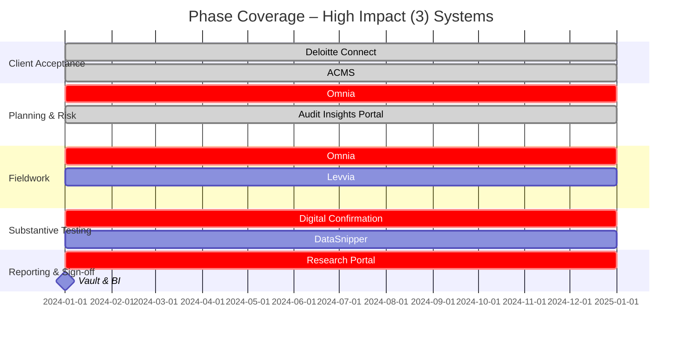

[# End‑to‑End Audit Data Flow & AI Opportunity Map

## 1. High‑Level Flow Diagram
```
Client            Deloitte            Core Audit Repositories             Analytics Engines                Authoring & Archive
Upload  ───►  Connect  ──►  EMS 4.x / Levia ──►  Omnia  ──►  Reveal → Cortex → Argus ──►  Word / Excel  ──►  Vault & BI
                  ▲                           │                                                  │
                  │                           └─►  Nightly / Realtime Bridge (2025)  ◄────────────┘
                  └─►  Direct Push (future)      
```
*Solid arrows = live today  |  Dashed arrows = future‑state once EMS is retired.*

---


## End‑to‑End Data Flow & AI Opportunities  🚚

| # | Flow Stage    | Systems                        | Pain‑Point         | AI / Automation Fix          |
| - | ------------- | ------------------------------ | ------------------ | ---------------------------- |
| 1 | Client upload | Deloitte Connect               | Manual PBC tagging | NLP auto‑tagger              |
| 2 | Sync          | EMS / Levia                    | Polling, dupes     | Event‑driven dedup           |
| 3 | Bridge        | Omnia                          | Nightly lag        | Direct push                  |
| 4 | Analytics     | Reveal → Cortex → Argus        | Multi‑hop ETL      | Unified GenAI + explanations |
| 5 | Authoring     | Word / Excel + local analytics | Manual refresh     | Auto‑cite & refresh          |
| 6 | Archive       | Vault                          | Manual trigger     | Predictive close             |
| 7 | Reporting     | Power BI / QlikView            | Siloed dashboards  | LLM unified KPI feed         |

# Audit‑Tech & AI Opportunities – Phase & Score View

**Rubric:** Impact 1‑3 (business value/risk reduction); Effort 1‑3 (complexity/time).  Focus effort on high‑impact, low‑effort cells first.

---

## 1. Core Systems  🗄️

| Technology                      | Audit Phase        | Deployed? | Impact | Effort | AI / Value Opportunity                                        | Key Notes                                   |
| ------------------------------- | ------------------ | --------- | ------ | ------ | ------------------------------------------------------------- | ------------------------------------------- |
| **Omnia**                       | Fieldwork          | **Yes**   | **3**  | 2      | GenAI pre‑populates docs; real‑time anomaly detection (v4.7). | Gaps vs EMS; MAT globalisation pending.     |
| **Levvia**                      | Fieldwork          | **Yes**   | 2      | 2      | Predictive planning for small audits.                         | v3 live Oct 2024; full AU rollout Jun 2025. |
| **EMS Client**                  | Fieldwork          | **Yes**   | 2      | 3      | AI summary of comments & evidence links.                      | Legacy; EOL May 2027.                       |
| **Audit Online / Diagnostics**  | Fieldwork‑Review   | **Yes**   | 2      | 1      | Real‑time in‑flight risk flags.                               | Web layer on EMS.                           |
| **Quality Assessment Platform** | Quality Mgmt       | **Yes**   | 2      | 2      | AI‑driven ISQM‑1 gap analysis.                                | ServiceNow GRC.                             |
| **InsightBox**                  | Substantive‑Assist | **Yes**   | 2      | 2      | GenAI suggests analytic packages & narratives.                | AU analytics platform.                      |
| **Digital Confirmation**        | Substantive        | No        | 2      | 1      | API automation via confirmation.com.                          | Decommissioned in AU; FS pilot.             |
| **Document AI (DocAI)**         | Fieldwork          | No        | **3**  | 2      | GenAI clause extraction; Omnia integration Jun 2025.          | Replaces Kira.                              |
| **Asset Count**                 | Substantive        | No        | 1      | 1      | Mobile vision for inventory counts.                           | BYOD hurdle.                                |
| **Checklist**                   | All phases         | **Yes**   | 1      | 1      | GenAI auto‑flagging of issues.                                | –                                           |
| **Scribe (Doc Generator)**      | Reporting          | No        | 2      | 2      | GenAI memo drafting.                                          | 1 US memo live.                             |
| **ACTT**                        | Internal Controls  | **Yes**   | 2      | 3      | AI explains control failures & remediation.                   | ERP SOD/GITC/FAC.                           |

---

## 2. Analytics & AI  📊

| Technology                | Audit Phase     | Deployed? | Impact | Effort | AI Opportunity                              | Notes                      |
| ------------------------- | --------------- | --------- | ------ | ------ | ------------------------------------------- | -------------------------- |
| **Argus / DocAI**         | Fieldwork       | Pilot     | **3**  | 2      | NLP extraction & auto‑risk memos.           | Global rollout ’25.        |
| **DataSnipper**           | Fieldwork       | **Yes**   | 2      | 1      | GenAI narrative on extracted evidence.      | Overlaps Tie‑out.          |
| **Process X‑ray**         | Planning‑Review | No        | 2      | 3      | GenAI test suggestions from process mining. | Hosted NL Azure.           |
| **Omnia DNAV**            | Substantive     | No        | 2      | 3      | LLM commentary on valuations.               | –                          |
| **Reveal Analytics**      | Substantive     | **Yes**   | 2      | 2      | Plain‑English regression outputs via LLM.   | –                          |
| **Audit Insights Portal** | Planning‑Review | **Yes**   | 2      | 2      | Risk‑trend forecasting.                     | –                          |
| **Data Science Platform** | Cross‑phase     | **Yes**   | 2      | 2      | Secure GenAI sandbox.                       | Azure foundation.          |
| **Omnia Data**            | Reporting       | Pilot     | 2      | 2      | GenAI narrative dashboards.                 | Pilot Apr 2025 → Dec 2025. |

---

## 3. GenAI Roadmap  🤖

| Technology             | Audit Phase     | Deploy Status      | Impact | Effort | Value                                            |
| ---------------------- | --------------- | ------------------ | ------ | ------ | ------------------------------------------------ |
| **Smart Review**       | Controls Review | Planned (May 2025) | **3**  | 1      | Auto‑reviews control narratives; suggests fixes. |
| **Research Assistant** | Planning        | Pilot              | 2      | 2      | Chatbot w/ citations; accuracy improvements.     |

---

## 4. Learning & Knowledge  📚

| Technology          | Audit Phase | Deployed?  | Impact | Effort | AI Opportunity                     |
| ------------------- | ----------- | ---------- | ------ | ------ | ---------------------------------- |
| **Research Portal** | Planning    | **Yes**    | **3**  | 2      | Semantic & LLM Q\&A.               |
| **Clever Nelly**    | Continuous  | **Yes**    | 2      | 2      | GenAI personalised learning paths. |
| **Auditorium**      | Methodology | **Yes**    | 1      | 1      | AI template recommender.           |
| **GAATE**           | Talent Dev  | **Yes**    | 1      | 2      | GenAI career coach.                |
| **DART**            | Planning    | Sunsetting | 1      | 1      | –                                  |

---

## 5. Support & Collaboration  🤝

| Technology                          | Audit Phase            | Deployed? | Impact | Effort | AI Opportunity                                                           |
| ----------------------------------- | ---------------------- | --------- | ------ | ------ | ------------------------------------------------------------------------ |
| **Deloitte Connect**                | Onboarding‑Substantive | **Yes**   | **3**  | 2      | Smart doc‑request bot; event‑driven sync.                                |
| **ACMS**                            | Acceptance             | **Yes**   | 2      | 2      | AI partner‑rotation checker.                                             |
| **Independence & Conflicts (GIDS)** | Acceptance             | **Yes**   | **3**  | 2      | API‑driven real‑time independence/conflict checks; auto‑flag exceptions. |
| **Dayshape**                        | Planning               | **Yes**   | 2      | 2      | GenAI scenario optimiser.                                                |
| **ADC Portal**                      | Fieldwork Support      | **Yes**   | 2      | 1      | Auto‑route tasks to RADC.                                                |
| **NICE CXone**                      | Support                | No        | 1      | 3      | Speech‑to‑insights; KB tagging.                                          |
| **Confluence/Jira**                 | PMO & Dev              | **Yes**   | 1      | 1      | LLM page/action summariser.                                              |

---

## 6. Pipeline / Not-Yet-Deployed  🛠️

| Tech                | Audit Phase | Impact | Effort | Opportunity             | Status                    |
| ------------------- | ----------- | ------ | ------ | ----------------------- | ------------------------- |
| **Tie‑out**         | FS Review   | 2      | 2      | LLM‑assisted tie‑outs.  | Future Omnia integration. |
| **DataSnipper FSS** | FS Review   | 2      | 2      | Alternative to Tie‑out. | Evaluation.               |

---

## 7. Add-to-CMDB & Utilities  📝

| Technology             | Audit Phase          | Impact | Effort | AI Opportunity              |
| ---------------------- | -------------------- | ------ | ------ | --------------------------- |
| **Data Lens**          | Reporting            | 2      | 2      | GenAI narrative over KPIs.  |
| **Corelogic**          | Specialist Valuation | 2      | 2      | Detect valuation anomalies. |
| **Controls Advantage** | Controls Testing     | 2      | 2      | AI risk ranking.            |
| **ExpenseWise**        | Advisory Analytics   | 1      | 2      | Classify spend anomalies.   |
| **Quizzed**            | Learning             | 1      | 1      | Auto‑generate quiz Qs.      |
| **ESG Readiness Tool** | ESG Advisory         | 2      | 2      | GenAI ESG gap analysis.     |

---

### Phase Coverage Snapshot (Mermaid)



*Above Gantt shows only systems with Impact = 3.*

---

*Feel free to adjust scores or add owners/cost columns.  High‑impact, low‑effort cells (Impact 3, Effort 1‑2) are your quick‑win backlog.*
](https://github.com/Deloitte-Australia/personal/blob/main/AuditOpp.md)
